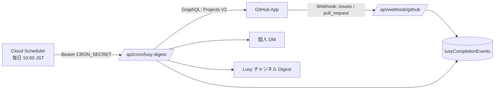

# Lusy GitHub Reminder Bot 設計ドキュメント

関連 issue: [#273](https://github.com/Lumos-Programming/lumos-web/issues/273)

## 1. 何のための機能か

Lusy の開発状況（GitHub Project 上の Issue / PR）を定期的に確認し、Discord へ通知する。

目的は厳格なタスク管理ではなく、**残っている作業を思い出させ、レビューを回し、終わった仕事を雑に褒めること**。
成功指標は「監視されている感じ」ではなく「なんか Lusy の GitHub が動いてる感じするな」と思えること。

通知文面は LLM で生成せず、固定テンプレート群からランダムに選ぶ。

## 2. 全体の流れ

取得（GraphQL）と完了検知（Webhook）を分けているのが要点。
定期実行の snapshot 差分だけだと、**前回実行から今回実行の間に作られて閉じられた** Item は
前回 state が存在せず検出できない。Webhook で拾って貯めておき、Digest でまとめて祝う。

## 3. なぜ GitHub App なのか

Projects V2 は GraphQL でしか読めず `read:project` 相当の権限が要る。
個人 PAT は所有者依存かつ期限切れリスクがあるため、Installation Token を使う。

必要な権限（すべて Read）:

| スコープ     | 権限                              | 用途                          |
| ------------ | --------------------------------- | ----------------------------- |
| Repository   | Issues / Pull requests / Metadata | Issue・PR の取得              |
| Organization | Projects                          | Project 上の Status field     |
| Organization | Members                           | **Team 宛レビュー依頼の展開** |

Bot は read-only。Draft 化 / reviewer 追加 / close / merge / Project status 変更は一切しない。

## 4. PR の分類

> [!IMPORTANT]
> `reviewDecision` は branch protection でレビューが必須化されていない repository では
> **常に null** になる。lumos-web は `main` が非保護のため実際に全 PR で null であり、
> `REVIEW_REQUIRED` を条件にすると何も分類されない。
> `deriveReviewState()` が `latestOpinionatedReviews` から自前で導出している。

優先順位は `merged > draft > changes_requested > approved > review_waiting > reviewer_unassigned`。

| 分類            | 条件                             | 次に動く人             |
| --------------- | -------------------------------- | ---------------------- |
| Draft           | OPEN && draft                    | author                 |
| 修正待ち        | 最新レビューに CHANGES_REQUESTED | author                 |
| Approved        | APPROVED あり                    | （MVP では通知しない） |
| Review Waiting  | reviewer 指名あり                | requested reviewer     |
| reviewer 未指定 | !draft && reviewer 0 人          | author                 |

`changes_requested` を `review_waiting` より先に判定するのは、修正要求が出ている PR で
reviewer に「レビューして」と ping してはいけないため。

### Team 宛のレビュー依頼

`reviewRequests` には User だけでなく Team が入る。Team 宛の場合は
Organization Members: Read で展開し、**メンバー全員に DM を送り、チャンネルにも載せる**。

- DM には「チーム宛」と明記して個人指名と区別する
- 誰か 1 人がレビューを出すと GitHub 側で Team の review request が外れ、自然に消える
- 通数が多すぎる場合は `LUSY_FANOUT_TEAM_REVIEWS=false` でチャンネルのみに落とせる
- 同じ人に個人指名と Team 経由の両方が来た場合は、個人指名を優先して 1 件に潰す

## 5. Issue の分類

未完了 = OPEN かつ Project Status が Done 系でない。

**assignee が居ない Issue も落とさない。** 「担当者未定」バケットとしてチャンネルに出す。
無担当こそ溜まりやすく、本機能が一番拾いたい層のため。

## 6. GitHub と Discord の紐付け

`members` コレクション（docId = discordId）の `githubId` / `github` を使う。

- **マッチングは `githubId`（数値 ID）優先。** GitHub username は改名できるため
- `optedOut` / `isSubAccount` のメンバーは DM 対象外
- 紐付けなしなら DM は送らず、チャンネルには `@github_login` を平文で表示する
- **GitHub 上のタスクを、Discord 紐付けが無いことを理由に一覧から除外しない**
- 存在しない Discord Mention は生成しない

## 7. Discord への送信

> [!IMPORTANT]
> Mention は必ず `content` に入れる。embed の description に `<@id>` を書いても
> 見た目は Mention になるが**通知は飛ばない**。

- 1 メッセージ 2000 文字の上限があるため、セクション境界で分割する
- `allowed_mentions.users` には**その chunk の本文に実際に載せた ID だけ**を渡す。
  セクション全体の ID をまとめて最後の chunk に付けると、先行 chunk の Mention が
  allowed_mentions から漏れて ping が飛ばなくなる
- DM は 1 実行あたり 1 人 1 メッセージにまとめる（Personal Action Queue）
- DM には完了したものを含めない。DM は「次に何をするか」に集中させる

## 8. 通知文面

`lib/lusy/templates.ts` にカテゴリごとの配列を持ち、ランダムに 1 つ選ぶ。

テンプレートは 2 種類に分かれる:

| 種類               | 変数         | 使える場面                 |
| ------------------ | ------------ | -------------------------- |
| `HEADER_TEMPLATES` | なし         | 複数 Item をまとめた見出し |
| `ITEM_TEMPLATES`   | `{{number}}` | Item が **1 件のときだけ** |

DM は複数 Item を 1 メッセージにまとめるため、この区別が無いと
「タスク #123「俺のこと、覚えてる？」」を 5 件の見出しに使ってしまう。

トーンの規約（丁寧語を使わない・人を責めない・世界観を作り込まない・短く保つ）は
issue #273 §11 が正。`templates.test.ts` が丁寧語混入と長さをテストで見張っている。

顔文字に半角 `\` を使わない。Discord は `\` を escape 文字として扱うため表示が崩れる。

## 9. 実行周期と冪等性

Cloud Scheduler は**毎日**叩き、実際に送るかどうかは `NOTIFICATION_INTERVAL_DAYS`
（既定 3 日）のクールダウンで決める。3 日周期でスケジュールすると 1 回失敗したときに
次の実行が 3 日後になるため（`refresh-avatars` と同じ方針）。

完了イベントは一度だけ通知する。`lusyCompletionEvents` の doc id は GitHub の node_id なので、
Webhook が再配信されても 1 件に潰れる。Digest 送信後に `notified: true` を立てる。
Issue が閉じられた直後に reopen された場合は、未通知なら取り消す。

## 10. エラー時

| 失敗        | 挙動                                                                                   |
| ----------- | -------------------------------------------------------------------------------------- |
| GitHub 取得 | 何も送らず snapshot も更新しない。`lastSuccessfulRunAt` を進めないので翌日再試行される |
| DM 個別     | 握りつぶして他ユーザーとチャンネル通知を継続。ログに残す                               |
| Team 展開   | チャンネルには出す（通知自体は落とさない）                                             |
| 紐付けなし  | エラーにしない。DM を skip し Digest には GitHub username を出す                       |

## 11. データモデル

| パス                            | 内容                                       | TTL   |
| ------------------------------- | ------------------------------------------ | ----- |
| `system/lusyReminder`           | `lastSuccessfulRunAt`, `lastTemplateIndex` | —     |
| `lusyCompletionEvents/{nodeId}` | 完了イベント（`notified` フラグ付き）      | 30 日 |
| `lusyItemSnapshots/{nodeId}`    | 状態遷移の追跡用                           | —     |
| `lusyNotificationLog/{auto}`    | 何を誰に送ったか                           | 90 日 |

TTL は `expiresAt` フィールドに対して `infra/firestore.tf` で設定している。

## 12. 関連ファイル

| ファイル                                                         | 役割                                                         |
| ---------------------------------------------------------------- | ------------------------------------------------------------ |
| `lib/lusy/github.ts`                                             | GitHub App 認証（JWT 自前署名）・Projects V2 取得・Team 展開 |
| `lib/lusy/classify.ts`                                           | Issue / PR を「次に誰が動くべきか」で分類                    |
| `lib/lusy/roster.ts`                                             | GitHub ユーザー → Discord ID の解決                          |
| `lib/lusy/digest.ts`                                             | DM 本文とチャンネル Digest の組み立て・分割                  |
| `lib/lusy/templates.ts`                                          | 通知文面のテンプレート                                       |
| `lib/lusy/store.ts`                                              | Firestore の状態保存                                         |
| `lib/lusy/reminder.ts`                                           | 定期実行の本体                                               |
| `app/api/cron/lusy-digest/route.ts`                              | Cloud Scheduler の受け口                                     |
| `app/api/webhook/github/route.ts`                                | GitHub Webhook の受け口                                      |
| `infra/scheduler.tf` / `infra/firestore.tf` / `infra/secrets.tf` | 定期実行・TTL・シークレット                                  |

## 13. 未対応 / 今後

- Approved かつ CI 成功の PR に「マージできるぞ」通知を出す（MVP では対象外）
- DM が届いた人をチャンネル Digest では Mention しない、という重複削減
- Project Status の変化（Draft → Ready など）に応じた通知カテゴリの切り替えは
  snapshot を保存しているだけで、まだ差分を使った出し分けはしていない
