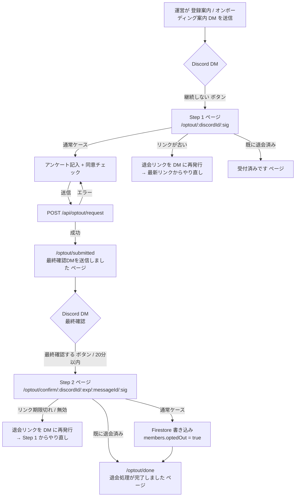
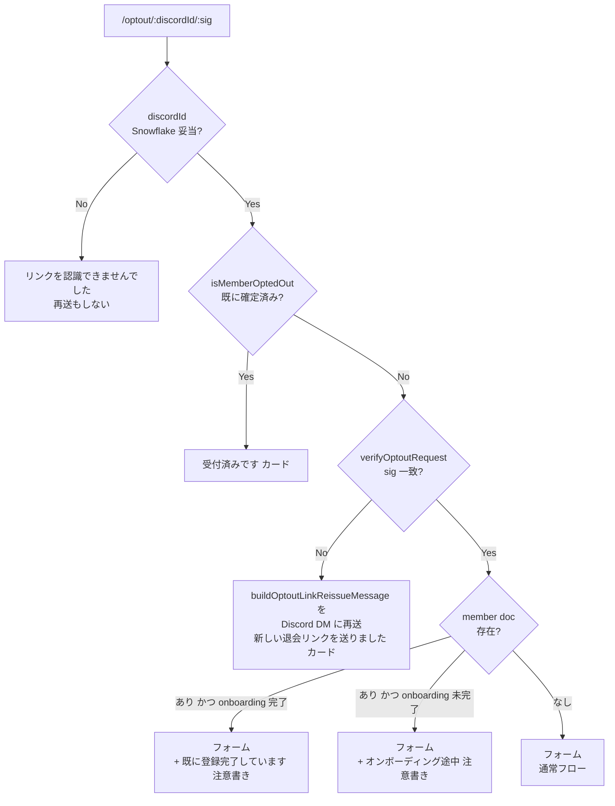
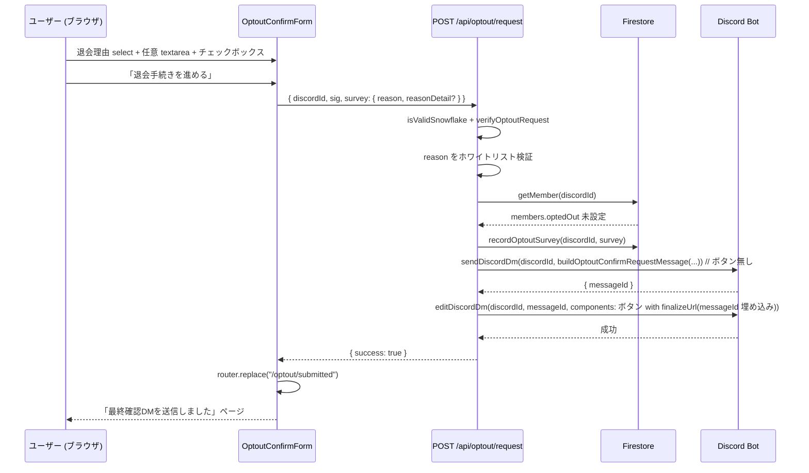
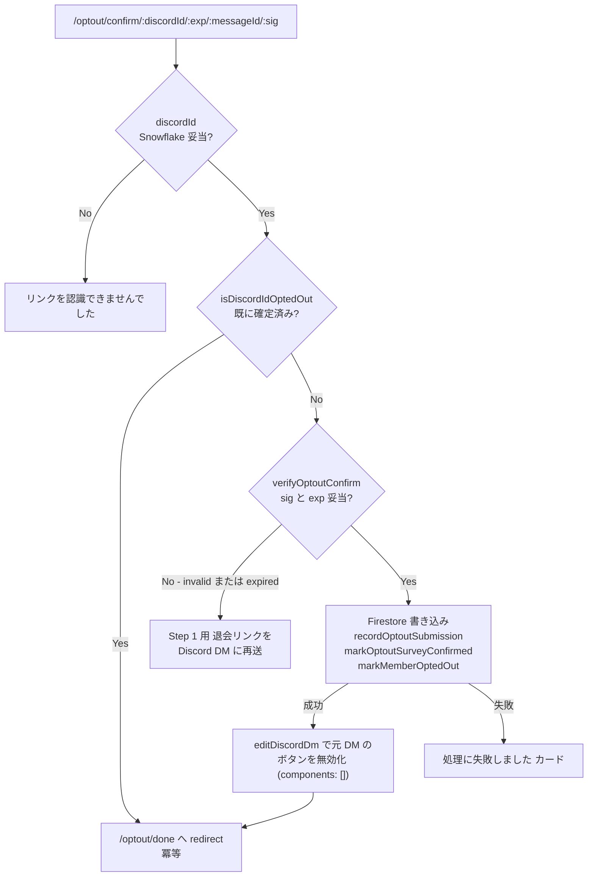
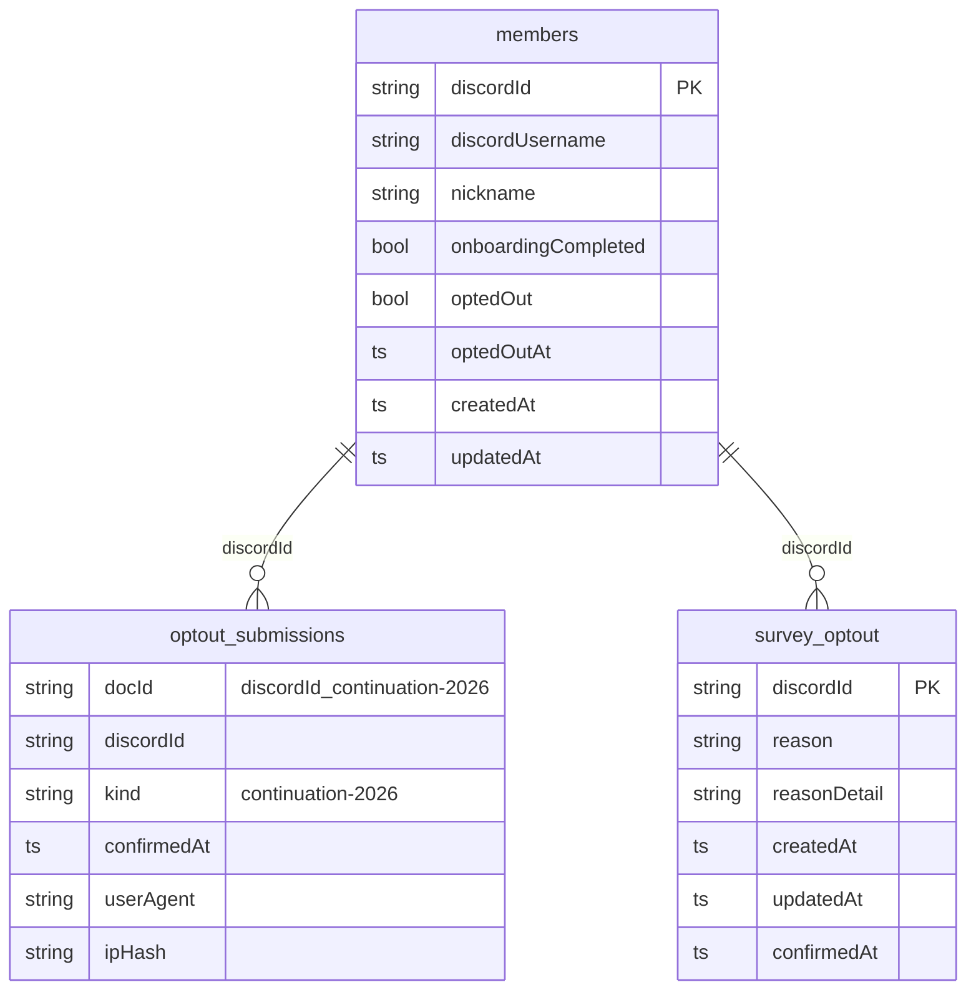
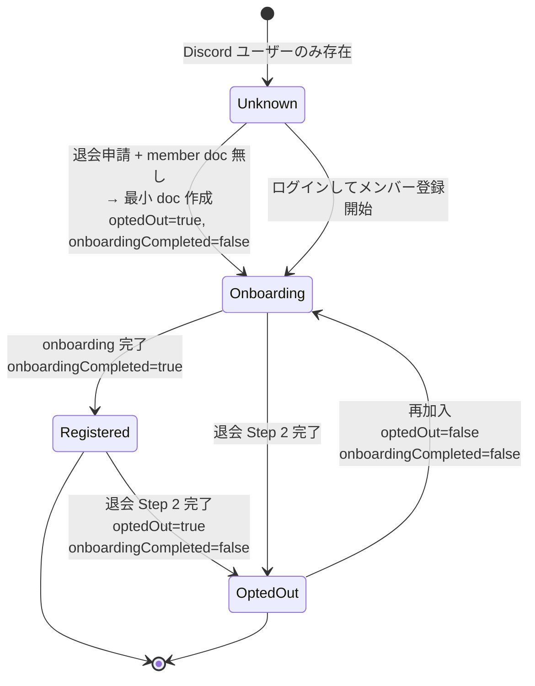
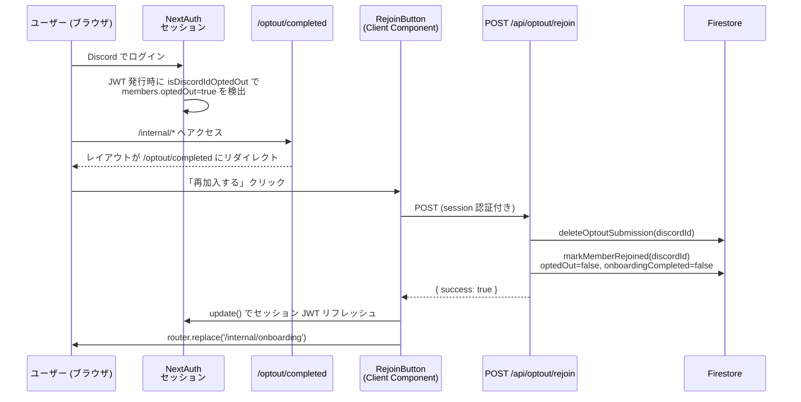

# 退会 (opt-out) フロー設計ドキュメント

Lumos Web の「継続しない / 退会する」フローの全体像。まずユーザー視点でどんな体験になるかを示し、その後で URL 設計・Firestore データモデル・関連コードへと降りていく。

---

## 1. ユーザーから見たフロー

退会は **Web と Discord DM を往復する二段階** で行う。誤クリックや第三者のいたずらで確定してしまわないよう、最後のワンクリックは Discord DM 側で行う設計。

### 基本動線

1. **きっかけ** — 運営が送る登録案内 / オンボーディング案内 DM の中に「継続しない」ボタンが含まれる。ここから退会フローに入る。
2. **Step 1: Web フォーム** — ボタンを踏むと Web (`/optout/...`) が開き、「なぜ退会するか」の簡単なアンケートと確認チェックボックスを入力して送信する。
3. **最終確認 DM が届く** — 送信直後に Discord DM で「退会処理を完了させる」ボタン付きの最終確認メッセージが届く。Web 側は「DM を送信しました」ページに切り替わる。
4. **Step 2: DM のボタンを踏む** — DM のボタンを 20 分以内に踏むと退会が確定し、「退会処理が完了しました」ページへ遷移する。

退会確定後も Discord サーバーから強制退出はさせない。メンバー用チャンネルの閲覧権限だけが外れる運用。

### ユーザージャーニー図

### 想定外ケースの扱い

- **リンクが古い / `AUTH_SECRET` がローテされた** → 自動的に新しい退会リンクを Discord DM に送り直す。ユーザーは最新の DM からやり直すだけで OK。
- **既に退会確定済みのリンクを再度踏んだ** → 「受付済みです」または「退会処理が完了しました」ページに飛ばすだけで、副作用は起こらない。
- **Step 2 の画面をリロードした** → 副作用の実行後に専用ページ `/optout/done` にリダイレクトさせることで、リロードでも処理が二度走らない。

---

## 2. 設計方針

### なぜ二段階確認 (Web → Discord DM) なのか

- Web 上の単発リンクだけでは、リンクが漏れた瞬間に第三者が退会を確定できてしまう。
- Discord DM は本人のアカウント所持を前提とする要素で、**本人性の担保** に使える。
- そこで Step 1 (Web) で書き込むのは **アンケート回答だけ**、退会確定フラグは Step 2 (Discord DM → Web) を経由したときに初めて書き込まれる。

### なぜ HMAC 署名 + 平文 discordId なのか

過去の設計では `discordId` を AES-GCM で暗号化したトークンをリンクに埋めていた。ただしこの方式には 2 つの欠点があった:

1. **`AUTH_SECRET` ローテ耐性がない**: 鍵が変わると、既に配布済みのリンクがどのユーザー宛か判別不能になる (復号できないので discordId が取り出せない)。
2. **再発行ができない**: リンクが無効になった時点で、サーバ側でどのユーザー宛の DM を再送すべきかわからない。

新しい方式は次の通り:

- URL path に **平文の `discordId` を載せる** (宛先が常に明らか)
- `sig` は HMAC-SHA256 による **正当性証明のみ** を担う
- 鍵は `sha256("lumos-optout-hmac|" + AUTH_SECRET)` でドメイン分離
- `AUTH_SECRET` ローテ後も discordId は URL に書かれているので、「古いリンクなので新しい DM を送ります」という **自動再発行** が成立する

### URL 構造

| ステップ              | URL                                                   | 有効期限 |
| --------------------- | ----------------------------------------------------- | -------- |
| Step 1 (Web フォーム) | `/optout/{discordId}/{sig}`                           | 無期限   |
| Step 2 (最終確認)     | `/optout/confirm/{discordId}/{exp}/{messageId}/{sig}` | 20 分    |

- `sig` = `HMAC-SHA256(key, LABEL \| discordId [\| exp])` の base64url エンコード
- Step 1 / Step 2 で `LABEL` を分けて HMAC のドメイン分離 (`optout-request-v1`, `optout-confirm-v1`) を行う
- Step 2 の `exp` は UNIX epoch 秒 (path 上に平文)。sig は exp を含めて署名するので改竄を検出できる

### 関連ソース

- `lib/discord-optout.ts` — トークン生成・検証、Firestore ヘルパー
- `lib/discord-dm.ts` — Discord DM テンプレート
- `app/optout/[discordId]/[sig]/page.tsx` — Step 1 ページ
- `app/optout/confirm/[discordId]/[exp]/[messageId]/[sig]/page.tsx` — Step 2 ページ (副作用実行)
- `app/optout/submitted/page.tsx` — Step 1 送信完了後のランディング (リロード安全)
- `app/optout/done/page.tsx` — Step 2 完了後のランディング (リロード安全)
- `app/optout/completed/page.tsx` — 退会済みユーザーがポータルに来たときのランディング
- `app/api/optout/request/route.ts` — Step 1 送信エンドポイント
- `app/api/optout/rejoin/route.ts` — 再加入エンドポイント
- `components/optout/confirm-form.tsx` — Step 1 フォーム
- `components/optout/rejoin-button.tsx` — 再加入ボタン

---

## 3. Step 1 技術詳細: 退会申請 (Web フォーム)

### 画面遷移 — `app/optout/[discordId]/[sig]/page.tsx`

- `Snowflake` 検証は `isValidSnowflake(discordId)` (`lib/auth.ts`)
- 登録状態に応じて `<OptoutConfirmForm>` に `notice` prop を渡すことで、「既にオンボーディング完了してます」などの文脈情報を表示しつつ、手続き自体はそのまま進められるようにしている。

### フォーム送信 — `components/optout/confirm-form.tsx`

- `recordOptoutSurvey` を**DM 送信より先**に実行する理由: DM 送信が失敗してもアンケート回答は残るため、ユーザーは同じ内容を再送信できる (冪等)。
- DM 送信が失敗した場合は `502` を返し、フォームに「Discord の DM 設定をご確認ください」というエラーを表示。
- 既に確定済みなら `{ success: true, alreadyRecorded: true }` を返し、フォーム側では `/optout/done` にリダイレクトして Step 2 完了と終状態を揃える。

### 最終確認 DM を「2 段階」で送る理由 (PR #215)

素朴に実装すると、最終確認 DM を 1 回の `POST /channels/{id}/messages` で送信して終わりにしたくなる。が、以下の **誤再押下** シナリオが問題になる:

1. ユーザーが最終確認 DM のボタンを踏んで退会確定
2. 気が変わって同じフローから再加入 (`/api/optout/rejoin`)
3. 退会確認 DM に残っていたボタンを誤って再押下 → **20 分以内ならトークンが有効なので再度退会確定してしまう**

そこで、確定時に **元の最終確認 DM そのものを PATCH してボタンを消す** 仕組みを入れた。これを実現するには、確定処理を行う `/optout/confirm/...` 画面が「どの DM メッセージを編集すればいいか」を知っている必要がある → **finalize URL の path に Discord の `messageId` を含めて HMAC 署名で改竄検出する** 設計になった。

ただしここで **chicken-and-egg 問題** が発生する: `messageId` は DM を送信しないと判明しない。一方、DM の中に埋めるボタンの URL は `messageId` を含めないといけない。この循環依存を解くために、Step 1 API は Discord への書き込みを 2 回に分けている:

1. `sendDiscordDm(...)` — **ボタン無しの embed のみ** を送信して `messageId` を取得
2. `editDiscordDm(messageId, { components })` — 取得した `messageId` を埋め込んだ finalize URL のボタンを後付けで PATCH

その結果、**最終確認 DM には Discord 側で「(編集済み)」マークが付く**。これはユーザー視点では違和感だが、仕組み上の必然であり、以下の挙動にも繋がる:

- Step 2 確定時の PATCH (`components: []`) で元 DM のボタンが消える → 再加入後の誤クリックを防げる
- `messageId` を含む finalize URL は HMAC 改竄検出されるので、攻撃者が URL 内の `messageId` だけ差し替えても sig が壊れて通らない

PATCH が失敗した場合は `502` を返す (ボタン無しの DM だけが届いた状態でフローが進んでしまうのを防ぐため)。dev-tools でのテスト送信 (`sendTestDiscordMessage`) も本番と同じ 2 段階にしており、挙動の非対称性を作らない。

---

## 4. Step 2 技術詳細: 最終確認 (Discord DM → Web)

### 画面遷移 — `app/optout/confirm/[discordId]/[exp]/[messageId]/[sig]/page.tsx`

ポイント:

- **`isDiscordIdOptedOut` を sig 検証より先に評価する**。`AUTH_SECRET` ローテで sig が壊れていても、既に退会済みなら完了ページへ飛ばすだけで済み、不要な再発行 DM を送らない。
- **GET で副作用を起こす** パターン (メール認証リンクと同じ)。副作用の冪等性は Firestore の固定 docId (`${discordId}_continuation-2026`) で担保。
- `noindex, nofollow` の `robots` メタ + `dynamic = "force-dynamic"` でブラウザプリフェッチ・クロール副作用を抑止。
- **invalid と expired で挙動を分けない**: どちらも Step 1 からやり直すべき状況なので、新しい退会リンクを送信する。
- **副作用完了後は必ず `/optout/done` にリダイレクト**。ユーザーが完了画面でリロードしても、署名付き URL が再実行されず副作用が重複しない。既に確定済みだった場合も同じページに飛ばして、ブラウザ履歴の巻き戻し耐性も確保している。
- **確定後に元 Confirm DM のボタンを削除する**。再加入→同じ DM のボタンを誤って再押下してしまうと、期限が20分以内なら再び退会確定してしまう。その事故を防ぐため、`messageId` を URL payload に埋めておき (HMAC で改竄検出)、確定時に `PATCH /channels/{channelId}/messages/{messageId}` で components を空配列に差し替える。編集失敗はログのみで握りつぶす (退会自体は成功扱い)。

### 書き込まれるもの

`Write` ステップで発生する変更:

| コレクション         | ドキュメント ID                  | 操作                                                                                               |
| -------------------- | -------------------------------- | -------------------------------------------------------------------------------------------------- |
| `optout_submissions` | `${discordId}_continuation-2026` | `set({...}, {merge: false})` で新規作成                                                            |
| `survey_optout`      | `${discordId}`                   | `set({confirmedAt}, {merge: true})` で追記 (存在する場合のみ)                                      |
| `members`            | `${discordId}`                   | `optedOut: true`, `optedOutAt`, `onboardingCompleted: false` を設定 (無ければ最小ドキュメント作成) |

---

## 5. Firestore データモデル

### 関連コレクション

### メンバードキュメントの状態遷移

- **member doc が無い段階でも `markMemberOptedOut` は最小 doc を作成する**。理由: 登録案内 DM の重複送信を防ぐため、`optedOutIds` に載せる必要がある。
- 再加入時は `onboardingCompleted` を必ず `false` にリセット。オンボーディングを最初からやり直してもらう。

---

## 6. 再加入フロー

### 目的

退会確定済みのユーザーが気が変わってポータルから再度参加する経路。オンボーディングをフルでやり直すことで、データの整合性とプライバシー同意の再取得を担保する。

### 経路

- `/internal/*` へのアクセスは `app/internal/layout.tsx` がセッションの `optedOut` を見て `/optout/completed` に転送する。
- JWT callback (`lib/auth.ts`) は毎リクエストで `isDiscordIdOptedOut` を通じて `members.optedOut` を読み直す。再加入 API 成功後にクライアントから `update()` を呼ぶと、新しい JWT は `optedOut=false` で再発行される。

---

## 7. 関連 DM テンプレート

`lib/discord-dm.ts` に全て集約している。

| テンプレート                       | 用途                                 | 埋め込むリンク                                                   |
| ---------------------------------- | ------------------------------------ | ---------------------------------------------------------------- |
| `buildRegistrationNudgeMessage`    | 未登録者への登録案内                 | 登録: `/internal` / 退会: `/optout/{discordId}/{sig}`            |
| `buildOnboardingNudgeMessage`      | オンボーディング途中の人への再開案内 | 再開: `/internal/onboarding` / 退会: `/optout/{discordId}/{sig}` |
| `buildOptoutConfirmRequestMessage` | Step 1 送信後の最終確認 DM           | 最終確認: `/optout/confirm/{discordId}/{exp}/{messageId}/{sig}`  |
| `buildOptoutLinkReissueMessage`    | 古いリンク検知時の再発行 DM          | 退会: `/optout/{discordId}/{sig}` (最新 sig)                     |

---

## 8. 登録案内 DM 側への影響

退会確定済みユーザーには **登録案内・オンボーディング案内 DM を一切送らない**。

- `lib/admin/actions.ts` の `getUnregisteredMembers()` が `optedOutIds` を除外した候補リストを返す (UI 表示用)
- `sendRegistrationNudge()` も送信直前に `getOptoutSubmissionIds()` で再取得してフィルタする (UI 取得と送信の間に退会した人を取りこぼさないため)

取得元:

- `getMemberRegistrationStatus()` (UI 側の候補リスト) は `members.optedOut=true` を対象に `optedOutIds` を返す
- `getOptoutSubmissionIds()` (送信直前フィルタ) は `optout_submissions` コレクションをクエリする

どちらも Step 2 完了時に同時に書き込まれるので結果は原則一致するが、二重防衛として両方で除外している。

---

## 9. セキュリティ・プライバシー上の考慮

- **本人性**: Step 1 のリンクだけでは退会確定しない。Step 2 は本人の Discord DM を経由するので、DM を盗聴できない限り第三者が確定できない。
- **改竄耐性**: URL 上の `discordId`, `exp` は HMAC で署名される。改竄すれば sig が一致しない。
- **timingSafeEqual** で sig 比較 → タイミング攻撃回避。
- **`AUTH_SECRET` ローテ耐性**: 鍵が変わっても宛先 discordId が URL に平文で書いてあるので、「このリンクは古いですね、新しい DM を送ります」というフォールバックが機能する。
- **IP ハッシュ化**: 最終確認ページでは IP を `HMAC-SHA256(AUTH_SECRET, ip).slice(0, 32)` で不可逆化してから保存 (audit 用)。
- **冪等性**: Step 2 で同じリンクを再クリックしても、Firestore の固定 docId により二重書き込みは発生せず「受付済み」カードを表示する。

---

## 10. 運用時の注意

- `AUTH_SECRET` をローテしたら、既存の退会リンクは**すべて無効**になる。ユーザーが古いリンクを踏むと自動的に新しい退会リンクを DM に送るので、基本は放置で OK。ただし Bot が DM をブロックされているユーザーには届かない点に注意。
- `OPTOUT_CONFIRM_TTL_SECONDS` (現在 20 分) を変えるときは、`lib/discord-optout.ts` を編集する。テスト時は一時的に `10` に下げて期限切れ分岐を検証できる。
- 退会アンケート (`survey_optout`) は `confirmedAt` が付いているものだけが「確定した退会者の回答」。Step 1 で離脱したユーザーの回答も保存はされているが、分析時はフィルタが必要。
