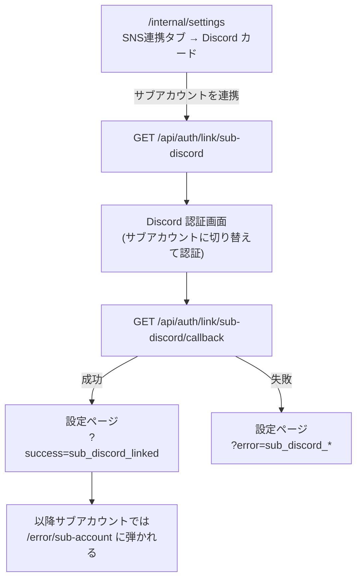

# サブアカウント連携フロー設計ドキュメント

メンバーが Discord の**サブアカウント**を 1 つだけ登録できる機能の設計。ユーザー体験 → データモデル → 関連コードの順に降りていく。

---

## 1. 何のための機能か

Lumos では画面共有をしながら通話に参加するために、**1 人が 2 つの Discord アカウントで同時に VC に入る**ことがある。この 2 つ目のアカウントは Discord サーバーには参加するが Lumos の会員ではない。

これを申告してもらわないと、運営側からは「サーバーにいるのに会員登録していない人」に見えてしまい、登録案内 DM の送信対象になってしまう。サブアカウントを登録してもらうことで:

- 管理画面の未登録メンバー一覧から除外できる
- サブアカウントで誤って Lumos Web にログインし、会員が二重に作られるのを防げる

---

## 2. ユーザーから見たフロー



- 連携の入口は **SNS連携タブの Discord カード内**。Discord 連携の延長であることが分かるよう、メインの Discord 行のすぐ下に置いている。
- 同じブラウザでは**メインアカウントのまま認証してしまいがち**。その場合は `self_link` エラーとして弾き、「Discordで別のアカウントに切り替えてからお試しください」というメッセージで復帰させる。
- 解除は同じ場所の「連携解除」から。サブ側のドキュメントごと削除するので、解除後はそのアカウントで通常どおりログイン・会員登録できる。

### 連携を拒否するケース

| エラーコード              | 条件                                            |
| ------------------------- | ----------------------------------------------- |
| `self_link`               | ログイン中のアカウント自身を連携しようとした    |
| `already_member`          | 対象が既に Lumos の (メイン) メンバーとして存在 |
| `already_linked_to_other` | 対象が既に別メンバーのサブとして連携済み        |
| `primary_has_sub`         | 連携できるサブは 1 つまで                       |
| `link_failed`             | state 不一致・トークン交換失敗などの一般エラー  |

---

### 誰のアカウントに書き込むかはセッションだけで決める

コールバックはメインアカウントの Discord ID を `auth()` のセッションからのみ取得する。

以前は GET 側で `oauth_link_primary_discord_id` cookie に保存して引き回していたが、cookie は送信側が自由に書き換えられるため身元の根拠にならない。「セッション == 送られてきた cookie」という検査は正規ユーザーしか縛らず、攻撃者は自分のセッションに合わせた cookie を送れば素通りする。`httpOnly` はレスポンス側の指示であって、クライアントが任意の cookie を **送る** ことは防げない。

そのため連携フローで持ち回る cookie は **`oauth_link_state_sub_discord` の 1 つだけ**にした。これは CSRF 対策として必要で外せない: 攻撃者が自分の Discord アカウントで取得した `code` をログイン中の被害者に踏ませても、攻撃者は被害者のブラウザに cookie を書けないので state が一致せず弾ける。

戻り先も cookie で持ち回らず `/internal/settings` 固定にしている。`redirectTo` を外から渡せる作りだと `new URL(value, origin)` が外部オリジンに解決され得る (オープンリダイレクト) が、渡せなければその経路自体が存在しない。

セッションだけを見る代償として、フローの途中で別メンバーにログインし直した場合を検知できなくなる。ただし連携先はその時点で認証されているメンバー本人であり、設定画面から解除もできるので実害はない。

## 3. データモデル

サブアカウントは専用コレクションを作らず、**`members` コレクションに専用フラグ付きのドキュメント**として置く。doc ID は他のメンバーと同じく Discord ID。

```
members/{メインのDiscordID}
  subAccountDiscordId: string   # 連携中のサブの Discord ID

members/{サブのDiscordID}
  isSubAccount: true            # サブアカウントの目印
  primaryDiscordId: string      # 紐づくメインの Discord ID
  discordUsername / discordHandle / discordAvatar
  linkedAt / createdAt / updatedAt
```

### なぜ members に同居させるのか

- doc ID が Discord ID なので、**同じ Discord ID がメンバーとサブの両方に存在する状態を構造的に作れない**。別コレクションだと「メンバーでもサブでもある」矛盾を弾くために毎回 2 コレクションを引く必要がある。
- ログイン拒否の判定 (`isSubAccountDiscordId`) が doc 1 件の取得で済む。

代償として、`members` を舐める処理はサブを除外する必要がある。現状の扱いは次のとおり:

| 関数                                      | サブの扱い                                           |
| ----------------------------------------- | ---------------------------------------------------- |
| `getPublicMembers` / `getMembersInternal` | `onboardingCompleted == true` の絞り込みで自然に除外 |
| `getMembersWithLine`                      | `lineId` を持たないので自然に除外                    |
| `getMemberRegistrationStatus`             | `subAccountIds` に分離し、登録案内の対象から外す     |
| `getMembersForDiscordAvatarRefresh`       | 除外しない (サブのアバターも更新して構わない)        |

`discordAvatar` は members と同じく **完全 URL ではなく avatar hash** を保存する。アバター更新バッチが同じ形式で書き戻すため。

### 整合性

連携・解除はどちらも **1 つのトランザクション**でメイン側とサブ側を同時に書き換える (`lib/sub-account.ts`)。片側だけ更新されて、メインからは見えないサブが残る状態を作らない。

---

## 4. ログイン拒否

`lib/auth.ts` の `signIn` コールバックで、`isSubAccountDiscordId` が真なら `/error/sub-account` へリダイレクトする。ギルド検証より前に判定するので、サブアカウント用の member doc が `getOrCreateMember` に上書きされることもない。

Firestore の読み取りに失敗した場合はログインを止めず、通常のギルド検証にフォールバックする (可用性優先。判定漏れで起きるのは「サブでログインできてしまう」だけで、被害は限定的)。

---

## 5. 退会との関係

メインが退会すると設定ページからサブを解除できなくなるため (退会済みアカウントは連携 API が 403)、退会確定時に `unlinkSubAccountOnOptout` でサブを自動解除する。放置するとそのサブアカウントは「ログインもできず、解除もできない」状態で `members` に残り続ける。

呼び出し元は退会確定ページ (`app/optout/confirm/.../page.tsx`)。解除に失敗しても退会自体は成立しているので、ログだけ出して処理を続ける。

---

## 6. 関連ファイル

| パス                                              | 役割                                       |
| ------------------------------------------------- | ------------------------------------------ |
| `lib/sub-account.ts`                              | 連携 / 解除 / 取得 / 判定 (Firestore 操作) |
| `app/api/auth/link/sub-discord/route.ts`          | 連携開始 (GET) と解除 (DELETE)             |
| `app/api/auth/link/sub-discord/callback/route.ts` | Discord OAuth コールバック                 |
| `components/sub-discord-settings.tsx`             | 設定ページの UI (Discord カード内に描画)   |
| `app/error/sub-account/page.tsx`                  | サブでログインした際のエラーページ         |
| `lib/sub-account.test.ts`                         | Firestore エミュレータ上のテスト           |
